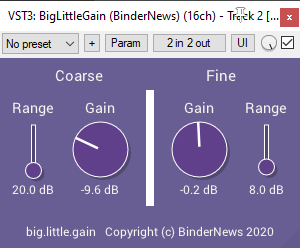
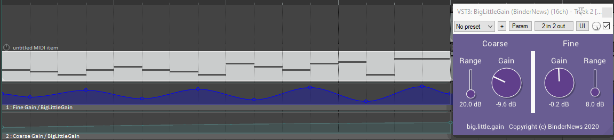

# Big.Little.Gain
A simple volume plugin that allows both coarse and fine-grained volume control.

This is a VST/VST3/AU plugin that provides two gain knobs, big (coarse) and little (fine).
The coarse gain knob is good for adjusting the volume of the track overall, while the fine
gain knob is useful for volume effects, where you only want to change the volume a few dB.

# Purpose
I wanted to make a neat volume effect, but all the compressors I have go from -70 dB to 30 dB,
or have equally large ranges. When I wanted a sine wave that went from +2 to -2 dB, it looked like a flat line.

Here's a demo of Big.Little.Gain where I have a sine wave automating the fine gain, and a
decrease on the coarse gain because the plugin is loud.

The Fine Range slider controls the minimum and maximum values of Fine Gain, so you can get those
precise automation clips.

# Installation
Download the latest release from the [releases page](https://github.com/Bindernews/BigLittleGain/releases/) and extract the zip file. Copy `BigLittleGain.vst3` to `C:\Program Files\Common Files\VST3` to install the VST3 version or copy `BigLittleGain_x64.dll` (for 64-bit users) or `BigLittleGain_Win32.dll` (for 32-bit users) to your VST plugins folder.

# License
The source code is released under the MIT License (see LICENSE.txt) and you may use this plugin free of charge for any purpose, commercial or non-commercial.
